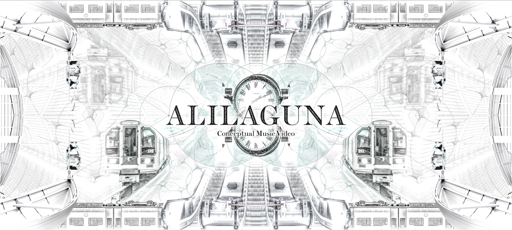

# ALILAGUNA

概念音乐影像：拍摄、剪辑、调色、VFX 与视觉排版。

**[完整设计案例](https://xiongzhiyuan-portfolio.pages.dev/zh/work/alilaguna/) · [求职作品总入口](https://github.com/Zhiyuan-Xiong/xiongzhiyuan-portfolio)**

## 项目目标

一段从现实走向死亡边界、再返回现实的旅程。地铁成为当代渡船：失灵的指示牌与扭曲的时间，让稳定的日常逐渐松动。影像将实拍、数字特效与三维空间相结合，通过倒放、镜像与分屏，使现实与虚拟世界彼此渗透。

## 我的贡献

影像导演：拍摄、剪辑、调色、VFX 与排版

完成阶段：已完成概念音乐影像

现有产出：完整 MV、概念拼贴、音乐分析、十二格分镜与制作过程

## 设计与制作过程

通过背景研究、概念推演、视觉原型和最终图像／影像组织案例。完整章节与个人职责保留在在线案例中；本仓库的案例资料与媒体可用于逐步查看制作证据。

## 仓库内容

- [media/](media/)：项目公开影像、图像与交互数据。
- [images/](images/)：作品集封面与不同尺寸展示图。
- [site-source/](site-source/)：对应案例文案、页面组件与相关交互实现。
- [case-data.json](case-data.json)：项目目标、职责、章节与产出信息。

## 查看与使用

GitHub 中可直接浏览图像、GIF、文案与实现文件。完整交互与影像观看入口为顶部的在线案例。网页组件的完整构建环境位于 [作品集总仓库](https://github.com/Zhiyuan-Xiong/xiongzhiyuan-portfolio)。

## 署名与使用

作品素材用于个人设计展示。协作项目以案例中的职责说明为准；字体、引擎和第三方资料遵循各自授权。未经许可，不将作品素材用于转载或商业用途。
